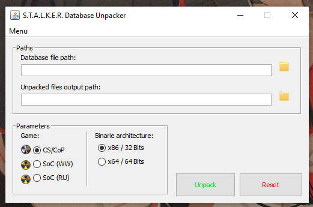

# S.T.A.L.K.E.R. Database Unpacker
+ Author: Rammaken
+ Version: 1.2
+ Programming Language: Java

# Brief
A portable and lightweight game files unpacker for S.T.A.L.K.E.R.: Clear Sky and S.T.A.L.K.E.R.: Call of Pripyat.
This little app was designed for modders who wants access to the packed stalker files, its pretty noob friendly and easy to use and has no extra features.

# Features
+ Unpacks any **.db** file from game files.
1. S.T.A.L.K.E.R.: Call of Pripyat (+ Mods)
2. S.T.A.L.K.E.R.: Clear Sky (+ Mods)
3. S.T.A.L.K.E.R.: Shadow of Chernobyl (+ Mods)

*Doesn't works for SoC Builds because it uses a different format...*

+ 32 Bits & 64 Bits binaries

# Requeriments
Needs Java Runtime Environment 1.8 to run the app.
https://www.java.com/es/download/ie_manual.jsp

# How-to-build
Needs Apache Netbeans IDE to open, edit and compile the project.
https://netbeans.apache.org/download/index.html
